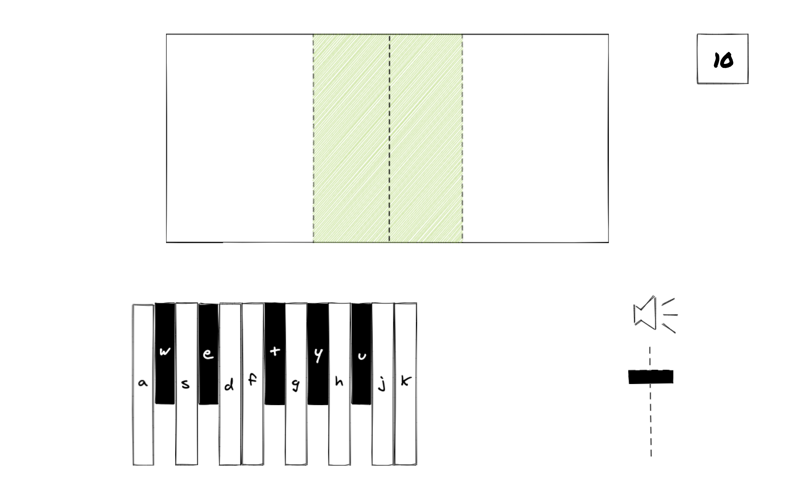
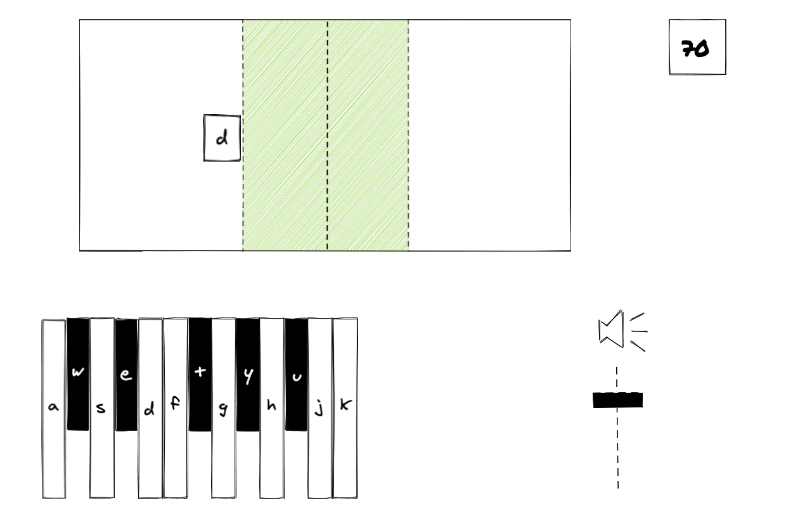
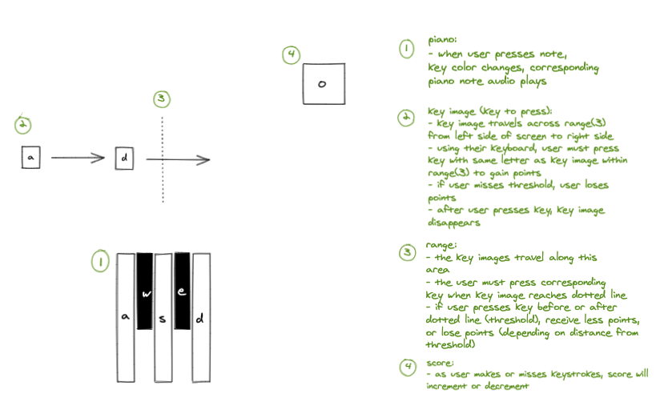

# Let's Play Piano!
Play piano using your computer keyboard!

## Motivation
Let's Play Piano comes from one of the most important aspects of my life, music.
Learning music provides me with an irreplaceable joy— as does teaching it. Let's Learn Piano offers a fun
way to understand the layout of a piano's keys and learn how to play it.

## Screenshots

## User Stories
* Press the start button to begin game
  - After pressing, the start button becomes a restart button
* The interface features a 13-key piano that can be played with the user's computer keyboard,
the score box towards the top right, a "volume slider", and the range in the center
* Once the game starts an image of a computer key with a letter on it appears over the game range
* The key moves across screen from left to right
* Watch as the key moves towards the green threshold of range
* Pressing the corresponding letter key on the keyboard when the image is within the green zone wins points
* Pressing the incorrect key, or pressing the correct key while the key image is not in the green zone will lose points
* When the song ends, the user is alerted:
  - Positive points will provide a winning message
  - Negative points will provide a losing message

## Wireframes

## Technologies & Code Snippets
* Javascript
* CSS
* HTML
* Below is my favorite piece of code. Although it is a large chunk of code,
it exemplifies a major turning point in coding Let's Play Piano. This is the
logic that controls the point gauging system, as well as the iterating of
key images.
  - document.querySelector(".range").appendChild(game.mary[this.index])
    game.mary[this.index].classList.add("key-pressed");
    game.currKeyImg = game.mary[this.index].alt;
    this.index++;
    let moveTime = 0;
    let interval = setInterval(function(e) { 
      if (moveTime === 5000) { 
      clearInterval(interval);
      let el = document.querySelector(".key-pressed")
      el.parentNode.removeChild(el)
      game.sweetSpot = false;
      if (game.index < game.mary.length) {
        game.moveKey()
      } else {
        game.win();
      }
      } else if (moveTime > 200 && moveTime < 2000) {
        console.log("sweet spot")
        moveTime+= 500
        game.sweetSpot = true;
        game.mary[this.index].classList.add("correct-key");
      } else {
        moveTime+= 500
        game.sweetSpot = false;
      }
    }, 500)
  },

## Credits
* https://stackoverflow.com/questions/16089421/simplest-way-to-detect-keypresses-in-javascript
* https://stackoverflow.com/questions/729921/settimeout-or-setinterval

I would like to thank Jacob for all of his help refactoring code to enable optimal execution. Jacob helped me understand the intricacies of setting intervals, as well as using recursion.

## Future Development
Let's Play Piano's successor will offer a catalog of songs, multiple tempos allowing for increased or relaxed levels of difficulty, and a more dynamic and interactive interface.